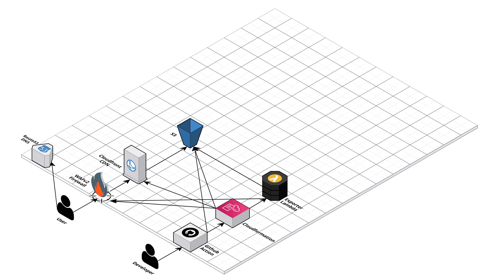
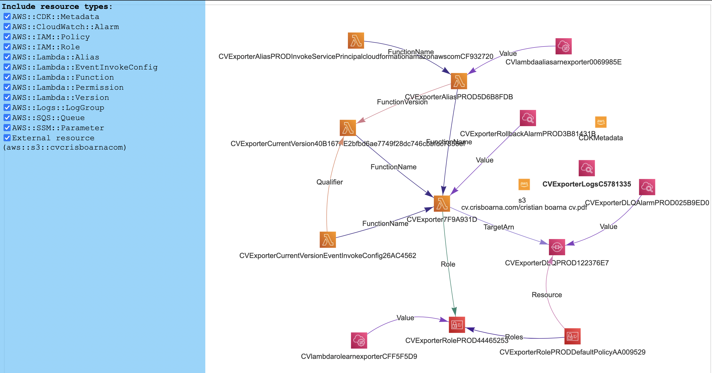
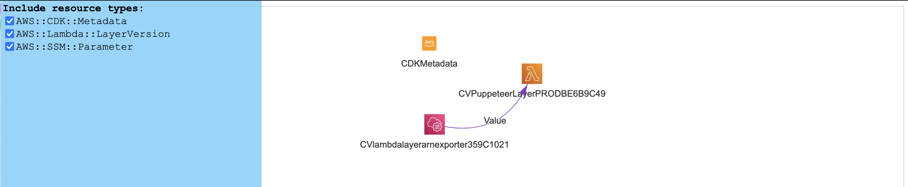
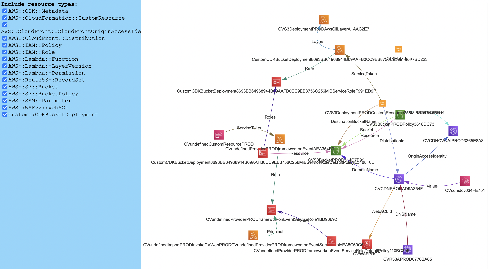

### Start

```shell
npx nx serve web
```

### Web

```shell
nx serve web
```

// in web/src/content se schirbimmba info
// daca o sa ruleze ok, s-ar putea sa nu fie nevoie de NX, pe viitor s-ar putea sa folosim simply CRA

### Exporter

```shell
nx serve exporter // nu cred ca o sa avem nevoie
```

Alternatively, in the `.run` folder there is run configuration for running the `exporter` from `IntelliJ`.

## Building

Build can be triggered across all services (`exporter`,`infra`,`web`) by running

```shell
yarn build
```

Alternatively each can be run individually via one of the commands

```shell
nx build-exporter-layer infra
nx build exporter
nx build infra
nx build web
```

## Linting

Linting can be triggered across all services (`exporter`,`infra`,`web`) by running

```shell
yarn lint
```

Alternatively each can be run individually via one of the commands

```shell
nx lint exporter
nx lint infra
nx lint web
```

_Note_

Infrastructure CDK code is linted with `eslint` and `cdk-nag`, the CDK equivalent of Cloudformation `cfn_nag` to ensure standard & best practice adherence by IaC.

Other apps are linted with `eslint`.

## Testing

Tests can be run across all services (`exporter`,`infra`,`web`) by running

```shell
yarn test
```

Alternatively each can be run individually via one of the commands

```shell
nx test exporter
nx test infra
nx test web
```

Testing coverage is enforced globally via the individual `jest.config.js` as follows

**Exporter**

| Category   | Minimum |
| ---------- | ------- |
| Branches   | 100%    |
| Functions  | 100%    |
| Lines      | 100%    |
| Statements | 100%    |

**Infrastructure**

| Category   | Minimum |
| ---------- | ------- |
| Branches   | 100%    |
| Functions  | 100%    |
| Lines      | 100%    |
| Statements | 100%    |

**Web**

| Category   | Minimum |
| ---------- | ------- |
| Branches   | 76%     |
| Functions  | 82%     |
| Lines      | 87%     |
| Statements | 87%     |

# Infrastructure

## Architectural Diagram



## Deployment from local

Single command

```shell
nx deploy infra
```

Individual components in order
_Note_ Deployment order is important as subsequent stacks have dependencies on previous ones.

```shell
cdk deploy -a 'npx ts-node --prefer-ts-exts -P apps/infra/tsconfig.app.json -r tsconfig-paths/register -r dotenv/config apps/infra/src/bin/Exporter-Layer.ts'
cdk deploy -a 'npx ts-node --prefer-ts-exts -P apps/infra/tsconfig.app.json -r tsconfig-paths/register -r dotenv/config apps/infra/src/bin/Exporter.ts'
cdk deploy -a 'npx ts-node --prefer-ts-exts -P apps/infra/tsconfig.app.json -r tsconfig-paths/register -r dotenv/config apps/infra/src/bin/Web.ts'
```

or simpler, with build included

```shell
nx deploy:layer infra
nx deploy:exporter infra
nx deploy:web infra
```

## Cloudformation Resource Diagrams

These are the diagrams of all resources and their connections as generated by `cfn-diagram` from the CDK source code.

To generate the diagram on the fly while tweaking the infrastructure run

```shell
nx diagram exporter
nx diagram layer
nx diagram web
```





# How to Contribute

1. Clone repo and create a new branch:

```shell
git checkout https://github.com/crisboarna/react-cv -b name_for_new_branch`.
```

2. Make changes and test
3. Submit Pull Request with comprehensive description of changes

## License

[](https://creativecommons.org/publicdomain/zero/1.0/)

Full license details can be found in [LICENSE.md](./LICENSE.md)
